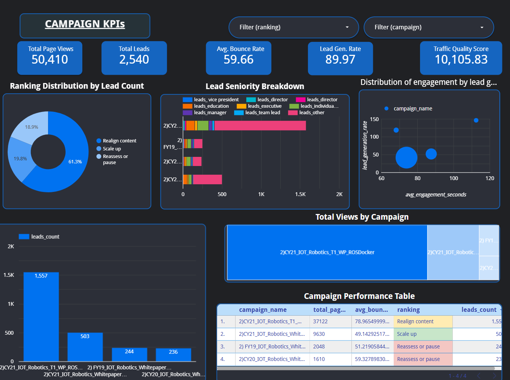

# campaign_analysis

## Overview
This project provides an interactive Campaign Performance Analysis Dashboard designed to evaluate marketing campaign effectiveness across multiple engagement and lead-generation metrics.

The dashboard helps stakeholders:

- Monitor campaign KPIs
- Compare campaign performance
- Analyze lead quality and engagement
- Identify optimization opportunities
- Make data-driven marketing decisions
  
---

## Dashboard Preview

## Key Features
### KPI Monitoring
The dashboard tracks major campaign metrics including:

- Total Page Views
- Total Leads
- Average Bounce Rate
- Lead Generation Rate
- Traffic Quality Score

These KPIs provide a high-level summary of campaign performance.

## Ranking Distribution Analysis
Campaigns are categorized into actionable recommendation groups:

- Realign Content
- Scale Up
- Reassess or Pause

This allows teams to prioritize optimization efforts efficiently.

## Engagement Analysis
The dashboard includes a bubble chart showing relationships between:

- Average Engagement Time
- Lead Generation Rate
- Campaign Size/Impact

This visualization helps identify high-performing campaigns with strong engagement quality.

## Campaign Traffic Visualization
### Bar Chart
Displays total lead count by campaign.

### Treemap
Shows relative contribution of campaigns to total page views.

These charts help quickly identify top-performing campaigns.

## Performance Table
A detailed campaign-level table includes:

- Campaign Name
- Total Page Views
- Average Bounce Rate
- Ranking
- Lead Count

This supports operational analysis and reporting.

## Insights Generated
The dashboard enables teams to answer questions such as:

- Which campaigns generate the most leads?
- Which campaigns have poor engagement quality?
- Which campaigns should be scaled?
- Are campaigns attracting senior decision-makers?
- Which campaigns produce high traffic but low conversions?

## Example Business Use Cases
### Marketing Optimization
Identify campaigns that need content alignment or budget adjustments.

### Lead Quality Assessment
Evaluate whether campaigns attract high-value audiences.

### Executive Reporting
Provide leadership with concise KPI summaries and visual insights.

### Campaign Prioritization
Focus resources on campaigns with the highest ROI potential.

## Technologies Used
Python
Pandas
Plotly
Jupyter Notebook (Google Colab)
CSV Data Processing
Data Visualization Libraries (Looker Studio)

## Dataset
`campaign_dashboard_summary.csv`
